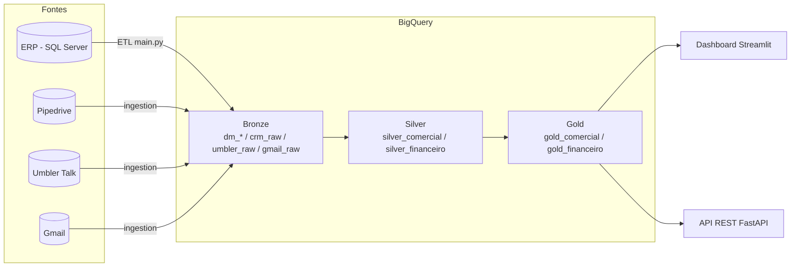

# Data Lake Nevoni

Plataforma de dados da Nevoni: um pipeline ETL que replica o ERP e demais
fontes operacionais para o BigQuery, um conjunto de transformações em camadas
(Bronze → Silver → Gold) e um dashboard gerencial em Streamlit que consome a
camada analítica.

O objetivo é dar à liderança uma visão 360° da operação — Comercial, Compras,
Produção, Estoque, Financeiro, Fiscal e SAC — a partir de dados versionados e
reproduzíveis, sem planilhas intermediárias.

---

## Arquitetura

O projeto segue a **Medallion Architecture**, com responsabilidades bem
separadas por camada:



| Camada | Datasets | Função | Regra |
|---|---|---|---|
| **Bronze** | `dm_*`, `crm_raw`, `umbler_raw`, `gmail_raw` | Réplica fiel da fonte, com mínima transformação | Sem regra de negócio; preserva soft-deletes (`excluded_at`) |
| **Silver** | `silver_comercial`, `silver_financeiro` | Limpeza, tipagem e regras de negócio | Aplica filtros de negócio explícitos e documentados |
| **Gold** | `gold_comercial`, `gold_financeiro` | Agregações prontas para consumo (KPIs, RFV, DRE) | Grão definido por tabela; é a camada que o dashboard consome |

O contrato detalhado entre Bronze e Silver (incluindo o tratamento de
soft-delete do ERP) está em [`docs/architecture/bronze_silver_contract.md`](docs/architecture/bronze_silver_contract.md).

---

## Fontes de dados

| Fonte | Tipo | Camada Bronze | Conteúdo |
|---|---|---|---|
| **ERP** | SQL Server | `dm_*` (8 domínios, 36 entidades) | Vendas, compras, estoque, produção, importações, financeiro |
| **CRM** | Pipedrive API v2 | `crm_raw` | Funis de vendas, recorrência, SAC, organizações, pessoas |
| **Atendimento** | Umbler Talk API | `umbler_raw` | Canais, conversas, contatos, setores |
| **E-mail** | Gmail API | `gmail_raw` | Mensagens e labels (metadados) |

Os domínios do ERP são carregados respeitando dependências:
`PARTNERS → PRODUCTS → QUOTES → ORDERS → INVENTORY → PAYMENTS → IMPORTS → PRODUCTION`.

---

## Estrutura do repositório

```
.
├── config/            # Configuração central do ETL e dos conectores
│   ├── settings.py    #   domínios, entidades, schemas BigQuery, ordem de carga
│   ├── umbler.py      #   parâmetros do conector Umbler
│   └── sources/       #   mapeamento de entidades por fonte (JSON)
├── extract/           # Extração das fontes
│   ├── sqlserver.py   #   leitura do ERP
│   ├── pipedrive.py / umbler.py
│   └── queries/       #   SQL de extração do ERP (uma query por entidade)
├── transform/         # Transformações, mapeamentos e normalização (encoding, cidades, nomes)
├── load/              # Carga no BigQuery (load/bigquery.py)
├── orchestration/     # Orquestração do pipeline ETL (pipeline.py)
├── ingestion/         # Framework de ingestão multi-fonte para a camada Bronze
│   └── connectors/    #   conectores plugáveis (pipedrive, umbler, gmail)
├── sql/               # Transformações Silver e Gold (SQL + scripts de build/populate)
│   ├── silver_comercial/  silver_financeiro/
│   └── gold_comercial/    gold_financeiro/
├── dashboard/         # Aplicação Streamlit
│   ├── app.py         #   página principal (visão geral / maturidade)
│   ├── pages/         #   uma página por setor (Financeiro, Comercial, SAC, ...)
│   └── utils/         #   cliente BigQuery, componentes de UI, tema, autenticação
├── api/               # API REST (FastAPI) servindo os dados comerciais em JSON
├── docs/              # Documentação técnica e de arquitetura
├── tests/             # Testes
├── main.py            # CLI do pipeline ETL (ERP → BigQuery)
├── Dockerfile         # Imagem do dashboard para Cloud Run
└── requirements*.txt  # Dependências (runtime, ETL e dev)
```

---

## Stack

- **Python 3.12**
- **BigQuery** como Data Warehouse (`google-cloud-bigquery`, `google-auth`)
- **SQL Server** como fonte do ERP (`pyodbc`)
- **Streamlit** + **Plotly** para o dashboard
- **FastAPI** + **Uvicorn** para a API REST
- **pandas** / **pyarrow** para manipulação de dados
- **structlog** para logging estruturado

---

## Pré-requisitos

- Python 3.12
- ODBC Driver 17+ for SQL Server (para a extração do ERP)
- Uma conta de serviço do GCP com acesso ao BigQuery (arquivo JSON)
- `gcloud` CLI (apenas para deploy)

---

## Configuração

1. Crie e ative um ambiente virtual:

   ```bash
   python -m venv .venv
   .venv\Scripts\activate      # Windows
   # source .venv/bin/activate  # Linux/macOS
   ```

2. Instale as dependências:

   ```bash
   pip install -r requirements.txt        # dashboard + libs comuns
   pip install -r requirements-etl.txt    # extração do ERP (pyodbc etc.)
   ```

3. Copie o template de variáveis de ambiente e preencha com os valores reais:

   ```bash
   copy .env.example .env                  # Windows
   # cp .env.example .env                   # Linux/macOS
   ```

   O `.env` (gitignored) concentra as credenciais do ERP, do BigQuery e dos
   conectores. Para o dashboard, as credenciais também podem ser fornecidas via
   `.streamlit/secrets.toml` (veja `.streamlit/secrets.toml.example`).

> As credenciais nunca são versionadas. Apenas os arquivos `.example` fazem
> parte do repositório.

---

## Como usar

### Pipeline ETL (ERP → BigQuery)

A CLI do ETL fica em `main.py`:

```bash
python main.py --test            # testa conexões com SQL Server e BigQuery
python main.py --list            # lista domínios e entidades
python main.py --create-tables   # cria as tabelas no BigQuery (sem carregar)
python main.py                   # executa o pipeline completo
python main.py --domain ORDERS   # processa apenas um domínio
python main.py --entity fact_sales_order
python main.py --validate        # valida a contagem de linhas pós-carga
```

### Ingestão multi-fonte (Bronze)

O framework de ingestão (Pipedrive, Umbler, Gmail) é executado como módulo:

```bash
python -m ingestion --help
```

Cada fonte é descrita por um arquivo em `config/sources/` e implementada por um
conector em `ingestion/connectors/`.

### Camadas Silver e Gold

As transformações analíticas ficam em `sql/`, organizadas por domínio e camada.
Cada pasta combina o SQL declarativo com scripts Python de build/validação, por
exemplo:

```bash
python sql/silver_comercial/run_silver_comercial.py
python sql/gold_comercial/run_gold_comercial.py
```

### Dashboard (Streamlit)

```bash
streamlit run dashboard/app.py --server.port=8080
```

No Windows há um atalho: `start_dashboard.bat`. O dashboard consome
preferencialmente a camada Gold; quando uma tabela Gold ainda não existe, ele
recorre ao Bronze automaticamente.

A página "Oráculo" é um assistente analítico opcional (OpenAI). Sem a chave
`OPENAI_API_KEY` configurada, a página fica desativada e o restante do dashboard
funciona normalmente.

### API REST (FastAPI)

```bash
python -m uvicorn api.main:app --reload --port 8000
```

Expõe em JSON os mesmos dados da página Comercial (vendas, compras, orçamentos,
ranking, CRM e RFV), para consumo por front-ends externos.

---

## Deploy

O dashboard é publicado no **Google Cloud Run** a partir do `Dockerfile`. O
script `deploy_cloudrun.bat` faz build, push e deploy, montando as credenciais
do BigQuery via Secret Manager:

```bash
deploy_cloudrun.bat
```

---

## Convenções

- **Camadas:** filtros de regra de negócio vivem no Silver, nunca no extract
  (Bronze). Veja o contrato em `docs/architecture/`.
- **Nomes de tabela:** prefixo por camada (`dm_`, `silver_`, `gold_`) e nome no
  singular descrevendo o grão.
- **Escrita no BigQuery:** `WRITE_TRUNCATE` por padrão nas cargas batch.
- **Texto de UI e documentação:** português, com acentuação correta.

---

## Testes

```bash
pytest
```
