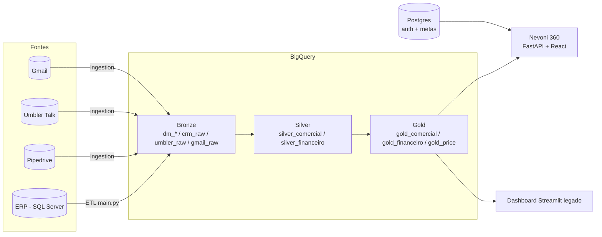

# Data Lake Nevoni

Plataforma de dados da Nevoni: um pipeline ETL que replica o ERP e demais
fontes operacionais para o BigQuery, um conjunto de transformações em camadas
(Bronze → Silver → Gold), e duas aplicações de consumo — o **Nevoni 360**
(plataforma gerencial FastAPI + React, principal) e um dashboard Streamlit
legado — que leem essa camada analítica.

O objetivo é dar à liderança uma visão 360° da operação — Vendas, Compras,
Financeiro, PRICE, Operacional/Produção, SAC, Engenharia e Jurídico — a partir
de dados versionados e reproduzíveis, sem planilhas intermediárias.

---

## Arquitetura

O projeto segue a **Medallion Architecture**, com responsabilidades bem
separadas por camada:



| Camada | Datasets | Função | Regra |
|---|---|---|---|
| **Bronze** | `dm_*`, `crm_raw`, `umbler_raw`, `gmail_raw` | Réplica fiel da fonte, com mínima transformação | Sem regra de negócio; preserva soft-deletes (`excluded_at`) |
| **Silver** | `silver_comercial`, `silver_financeiro` | Limpeza, tipagem e regras de negócio | Aplica filtros de negócio explícitos e documentados |
| **Gold** | `gold_comercial`, `gold_financeiro`, `gold_price` | Agregações prontas para consumo (KPIs, RFV, DRE, margem) | Grão definido por tabela; é a camada que Nevoni 360 e o dashboard consomem |

O contrato detalhado entre Bronze e Silver (incluindo o tratamento de
soft-delete do ERP) está em [`docs/architecture/bronze_silver_contract.md`](docs/architecture/bronze_silver_contract.md).

---

## Fontes de dados

| Fonte | Tipo | Camada Bronze | Conteúdo |
|---|---|---|---|
| **ERP** | SQL Server | `dm_*` (8 domínios, 36 entidades) | Vendas, compras, estoque, produção, importações, financeiro |
| **CRM** | Pipedrive API v2 | `crm_raw` | Funis de vendas, recorrência, SAC, organizações, pessoas, atividades |
| **Atendimento** | Umbler Talk API | `umbler_raw` | Canais, conversas, contatos, setores |
| **E-mail** | Gmail API | `gmail_raw` | Mensagens e labels (metadados) |

Os domínios do ERP são carregados respeitando dependências:
`PARTNERS → PRODUCTS → QUOTES → ORDERS → INVENTORY → PAYMENTS → IMPORTS → PRODUCTION`.

---

## Nevoni 360 — plataforma gerencial

O **Nevoni 360** é a aplicação principal de consumo: um backend **FastAPI**
que lê a camada Gold do BigQuery (dados validados, batendo ao centavo com o
ERP) e um **Postgres** próprio (usuários, permissões, metas), servindo um
frontend **React** — tudo publicado como **um único container**.

### Por que essa arquitetura

- **BigQuery é só leitura, nunca escrita de aplicação.** Tudo que o usuário
  edita (metas mensais, parâmetros de custo do PRICE, usuários e permissões)
  vive no Postgres — o BigQuery continua sendo gerado exclusivamente pelo
  pipeline ETL/Silver/Gold, nunca pela aplicação web.
- **Container único, mesma origem.** O build do React (`web/dist`) é copiado
  para dentro da imagem do FastAPI, que serve tanto a API (`/api/*`) quanto os
  arquivos estáticos do frontend. Isso elimina CORS e configuração de dois
  domínios — um único serviço, um único deploy.
- **Permissão positiva.** Cada usuário só vê as páginas e abas que foram
  explicitamente liberadas para ele (`paginas_liberadas` / `recursos_liberados`
  no cadastro) — o padrão é tudo oculto, não tudo visível.

### Setores (páginas)

| Setor | Fonte principal |
|---|---|
| Visão Geral | Frescor das cargas ETL, saúde do pipeline |
| Vendas (Comercial) | Vendas, Gestão à Vista, Matriz RFV, Performance |
| Compras | Importações, fornecedores, concentração |
| Financeiro | KPIs, DRE, Contas a Receber/Pagar, Liquidações, Fluxo de Caixa |
| PRICE | Margem e lucro líquido por produto × canal (ERP + parâmetros manuais) |
| Operacional e Produção | Ordens de produção, estoque, BOM |
| SAC e AT | Atendimentos, SLA, chamadas, chat |
| Engenharia e P&D | Catálogo de produtos, estrutura técnica (BOM), roadmap |
| Jurídico | — |
| Oráculo | Assistente analítico (OpenAI), opcional |

### Estrutura

```
api/                       # Backend FastAPI
├── main.py                #   monta as rotas, serve o build do React (WEB_DIST)
├── auth.py / security.py  #   sessão via cookie httpOnly, bcrypt, bootstrap do admin
├── db.py                  #   engine SQLAlchemy (Postgres em prod, SQLite em dev local)
├── access_catalog.py      #   catálogo de páginas/abas para o controle de acesso
├── bq.py                  #   cliente BigQuery + cache de query (TTL 1h)
├── queries.py             #   consultas canônicas de Comercial/RFV/Vendas/Ranking
├── gestao_vista.py         #   meta x realizado, ranking, engenharia reversa, atividades CRM
├── price.py                #   margem por produto x canal (fatos ERP + parâmetros manuais)
├── financeiro.py / operacional.py / sac.py / engenharia.py / calendario.py / performance.py
├── metas.py                #   metas mensais (Postgres)
├── admin.py                #   CRUD de usuários e permissões
└── oraculo.py               #   assistente analítico (OpenAI)

web/                        # Frontend React (Vite + TypeScript)
├── src/pages/              #   uma página por setor (roteamento react-router)
├── src/tabs/                #   abas dentro de cada setor (ex: Vendas, RFV, Performance)
├── src/components/          #   layout, sidebar, cards, tabelas, gráficos reutilizáveis
├── src/lib/                 #   cliente HTTP + hooks (@tanstack/react-query), formatação, auth
└── src/theme.ts              #   tokens visuais (cores, ordem de canais, paletas RFV)

docker/
└── nevoni360.Dockerfile     # build multi-estágio: React (node) → estáticos dentro da imagem Python/FastAPI
```

### Stack do Nevoni 360

- **Backend:** FastAPI + Uvicorn, SQLAlchemy 2.0 (Postgres), `google-cloud-bigquery`
- **Frontend:** React 19 + Vite + TypeScript, TanStack Query, React Router, Recharts, Tailwind CSS 4, Lucide Icons
- **Autenticação:** sessão via cookie httpOnly, senha com bcrypt (`bcrypt_sha256`), permissão positiva por página/aba
- **Deploy:** container único, build multi-estágio (`docker/nevoni360.Dockerfile`) — o Dockerfile builda o frontend com Node, copia os estáticos para dentro da imagem Python final, e o próprio FastAPI serve tudo em uma única porta

### Rodando localmente

```bash
# Backend (porta 8000)
python -m uvicorn api.main:app --reload --port 8000

# Frontend em modo dev (porta 5173, com proxy /api -> :8000)
cd web
npm install
npm run dev
```

---

## Estrutura do repositório (visão geral)

```
.
├── config/            # Configuração central do ETL e dos conectores
│   ├── settings.py    #   domínios, entidades, schemas BigQuery, ordem de carga
│   ├── umbler.py      #   parâmetros do conector Umbler
│   └── sources/       #   mapeamento de entidades por fonte (JSON)
├── extract/           # Extração das fontes
│   ├── sqlserver.py   #   leitura do ERP
│   ├── pipedrive.py / umbler.py
│   └── queries/       #   SQL de extração do ERP (uma query por entidade)
├── transform/         # Transformações, mapeamentos e normalização (encoding, cidades, nomes)
├── load/              # Carga no BigQuery (load/bigquery.py)
├── orchestration/     # Orquestração do pipeline ETL (pipeline.py)
├── ingestion/         # Framework de ingestão multi-fonte para a camada Bronze
│   └── connectors/    #   conectores plugáveis (pipedrive, umbler, gmail)
├── sql/               # Transformações Silver e Gold (SQL + scripts de build/populate)
│   ├── silver_comercial/  silver_financeiro/
│   └── gold_comercial/    gold_financeiro/    gold_price/
├── api/               # Backend FastAPI do Nevoni 360 (ver seção acima)
├── web/               # Frontend React do Nevoni 360 (ver seção acima)
├── docker/            # Dockerfiles (ETL e Nevoni 360)
├── dashboard/         # Aplicação Streamlit legada
│   ├── app.py         #   página principal (visão geral / maturidade)
│   ├── pages/         #   uma página por setor
│   └── utils/         #   cliente BigQuery, componentes de UI, tema, autenticação
├── docs/              # Documentação técnica e de arquitetura
├── tests/             # Testes
├── main.py            # CLI do pipeline ETL (ERP → BigQuery)
└── requirements*.txt  # Dependências (runtime, ETL e dev)
```

---

## Stack

- **Python 3.12**
- **BigQuery** como Data Warehouse (`google-cloud-bigquery`, `google-auth`)
- **Postgres** para autenticação e metas do Nevoni 360
- **SQL Server** como fonte do ERP (`pyodbc`)
- **FastAPI** + **React** para o Nevoni 360 (ver seção dedicada acima)
- **Streamlit** + **Plotly** para o dashboard legado
- **pandas** / **pyarrow** para manipulação de dados
- **structlog** para logging estruturado

---

## Pré-requisitos

- Python 3.12
- Node 22+ (para o frontend do Nevoni 360)
- ODBC Driver 17+ for SQL Server (para a extração do ERP)
- Uma conta de serviço do GCP com acesso ao BigQuery (arquivo JSON)
- Um Postgres acessível (ou SQLite local para dev, usado por padrão)
- `gcloud` CLI (apenas para deploy do dashboard legado)

---

## Configuração

1. Crie e ative um ambiente virtual:

   ```bash
   python -m venv .venv
   .venv\Scripts\activate      # Windows
   # source .venv/bin/activate  # Linux/macOS
   ```

2. Instale as dependências:

   ```bash
   pip install -r requirements.txt        # dashboard + libs comuns
   pip install -r requirements-etl.txt    # extração do ERP (pyodbc etc.)
   pip install -r api/requirements.txt    # backend do Nevoni 360
   ```

3. Copie o template de variáveis de ambiente e preencha com os valores reais:

   ```bash
   copy .env.example .env                  # Windows
   # cp .env.example .env                   # Linux/macOS
   ```

   O `.env` (gitignored) concentra as credenciais do ERP, do BigQuery e dos
   conectores. Para o dashboard legado, as credenciais também podem ser
   fornecidas via `.streamlit/secrets.toml` (veja `.streamlit/secrets.toml.example`).

> As credenciais nunca são versionadas. Apenas os arquivos `.example` fazem
> parte do repositório.

---

## Como usar

### Pipeline ETL (ERP → BigQuery)

A CLI do ETL fica em `main.py`:

```bash
python main.py --test            # testa conexões com SQL Server e BigQuery
python main.py --list            # lista domínios e entidades
python main.py --create-tables   # cria as tabelas no BigQuery (sem carregar)
python main.py                   # executa o pipeline completo
python main.py --domain ORDERS   # processa apenas um domínio
python main.py --entity fact_sales_order
python main.py --validate        # valida a contagem de linhas pós-carga
```

### Ingestão multi-fonte (Bronze)

O framework de ingestão (Pipedrive, Umbler, Gmail) é executado como módulo:

```bash
python -m ingestion --help
```

Cada fonte é descrita por um arquivo em `config/sources/` e implementada por um
conector em `ingestion/connectors/`.

### Camadas Silver e Gold

As transformações analíticas ficam em `sql/`, organizadas por domínio e camada.
Cada pasta combina o SQL declarativo com scripts Python de build/validação, por
exemplo:

```bash
python sql/silver_comercial/run_silver_comercial.py
python sql/gold_comercial/run_gold_comercial.py
```

### Nevoni 360 (backend + frontend)

Ver seção dedicada acima. Resumo rápido:

```bash
python -m uvicorn api.main:app --reload --port 8000   # backend
cd web && npm install && npm run dev                    # frontend
```

### Dashboard legado (Streamlit)

```bash
streamlit run dashboard/app.py --server.port=8080
```

No Windows há um atalho: `start_dashboard.bat`. O dashboard consome
preferencialmente a camada Gold; quando uma tabela Gold ainda não existe, ele
recorre ao Bronze automaticamente.

---

## Deploy

- **Nevoni 360:** container único (`docker/nevoni360.Dockerfile`), publicado em
  serviço de hospedagem em nuvem com deploy automático a cada push. Credenciais
  do BigQuery e a chave do Oráculo entram via variável de ambiente, nunca
  versionadas.
- **Dashboard legado:** publicado no **Google Cloud Run** a partir do
  `Dockerfile`. O script `deploy_cloudrun.bat` faz build, push e deploy,
  montando as credenciais do BigQuery via Secret Manager:

  ```bash
  deploy_cloudrun.bat
  ```

---

## Convenções

- **Camadas:** filtros de regra de negócio vivem no Silver, nunca no extract
  (Bronze). Veja o contrato em `docs/architecture/`.
- **Nomes de tabela:** prefixo por camada (`dm_`, `silver_`, `gold_`) e nome no
  singular descrevendo o grão.
- **Escrita no BigQuery:** `WRITE_TRUNCATE` por padrão nas cargas batch;
  BigQuery nunca recebe escrita vinda da aplicação — isso fica no Postgres.
- **Texto de UI e documentação:** português, com acentuação correta.
- **Nevoni 360 — acesso:** permissão positiva (tudo oculto por padrão); novas
  páginas/abas entram sempre ocultas até serem liberadas explicitamente.

---

## Testes

```bash
pytest
```
